# GenLite Architecture Flow Diagram

## 🏗️ Overall Architecture Flow

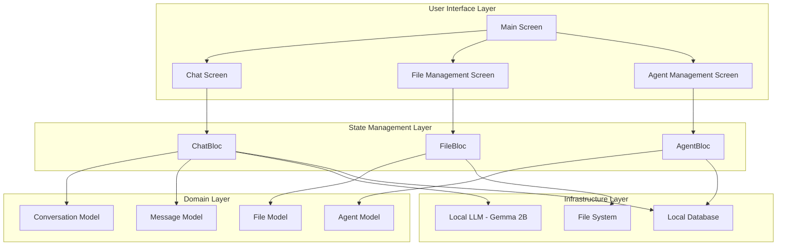

## 🔄 P0 - Chat Interface Flow

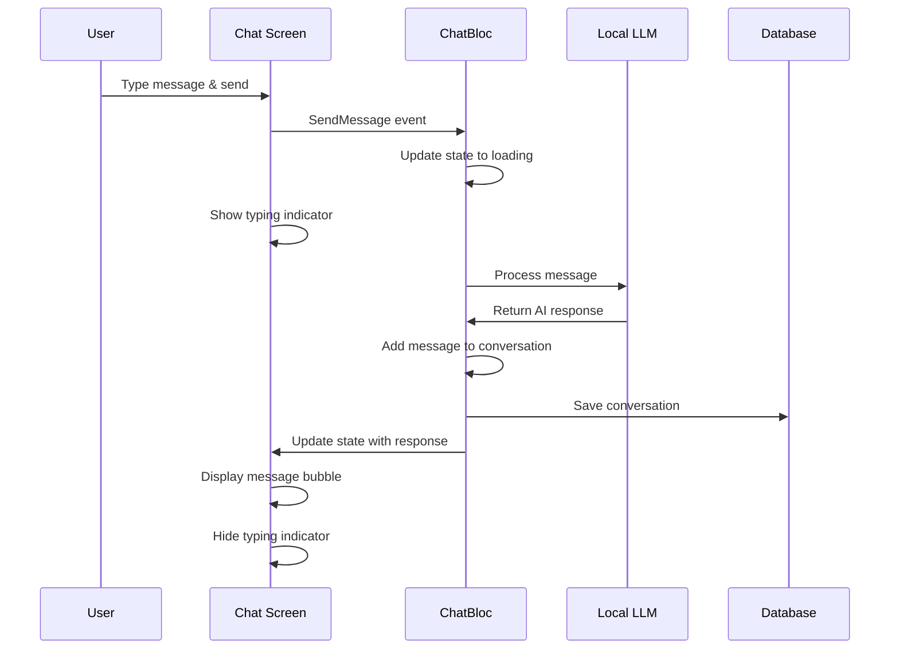

## 📁 P1 - File Upload & Q&A Flow

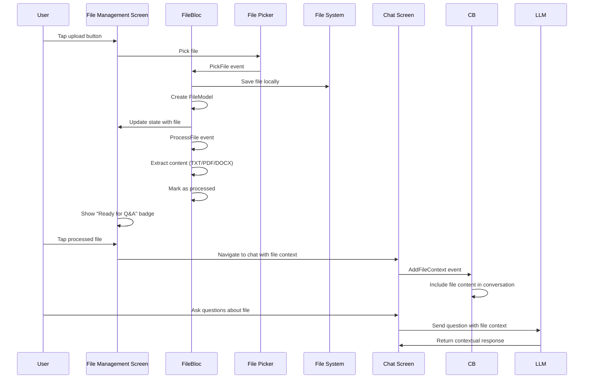

## 🤖 P2 - Custom Agents Flow

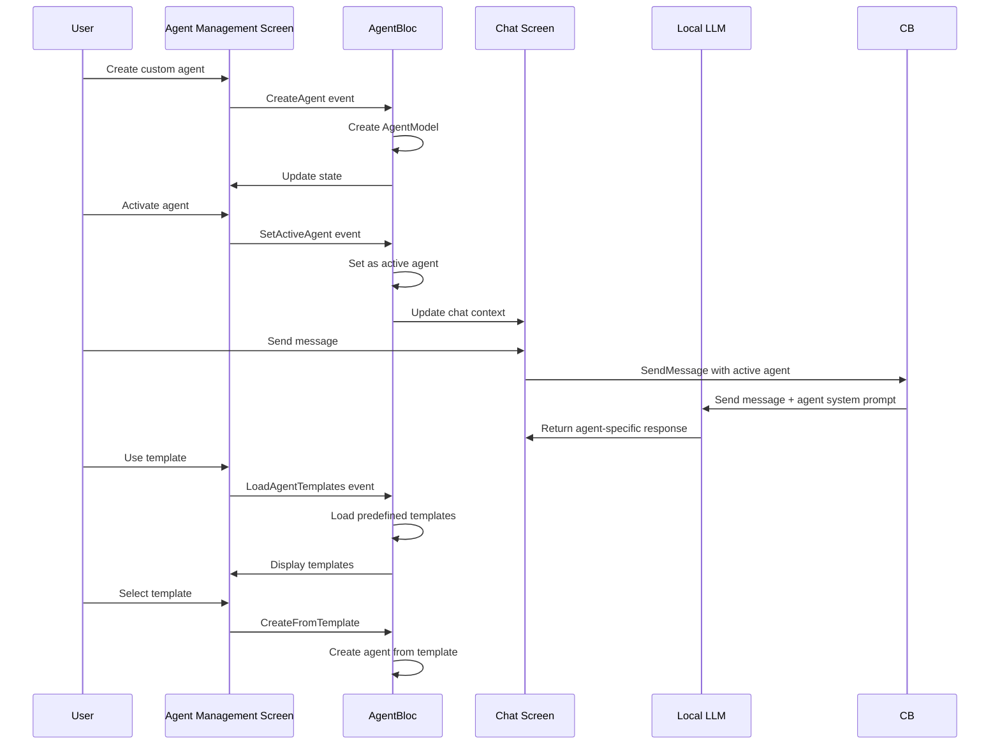

## 🔍 P1 - Conversation Management Flow

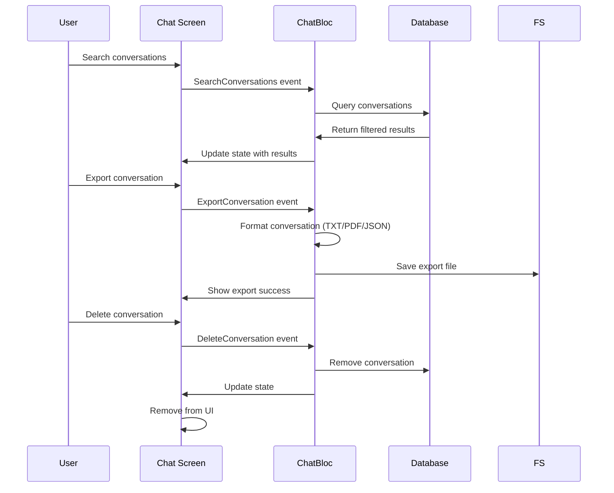

## 🏛️ Clean Architecture Layers

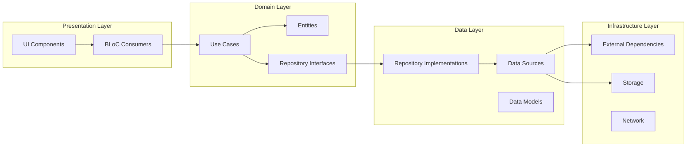

## 📊 State Management Flow

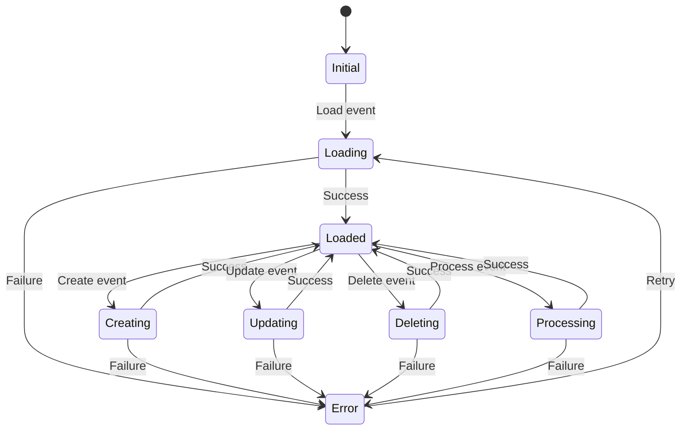

## 🔗 Feature Integration Points

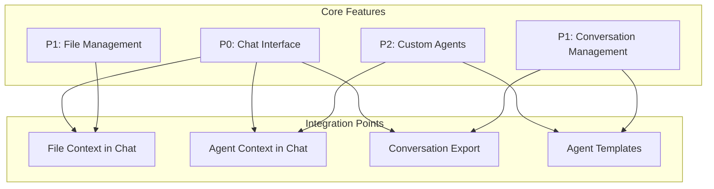

## 🎯 User Journey Flow

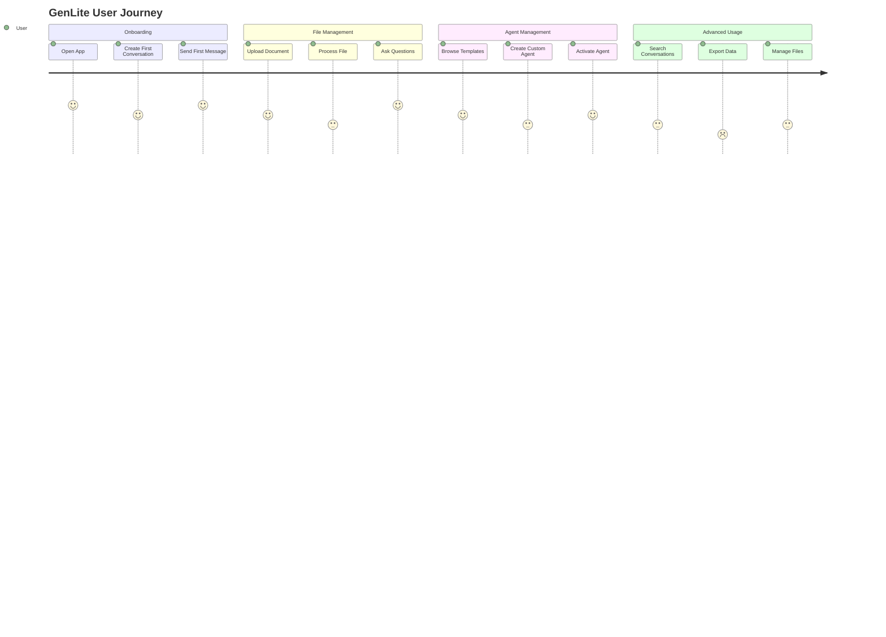

## 🔧 Technical Implementation Flow

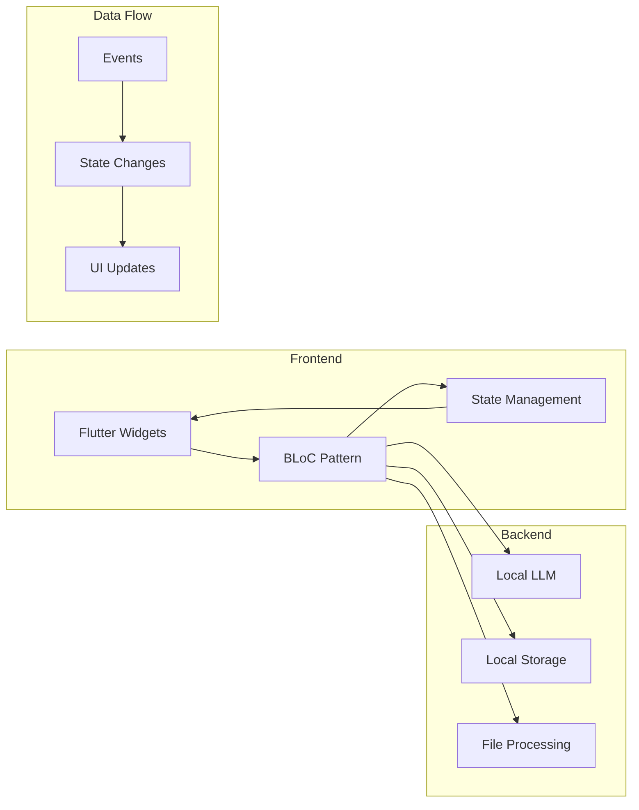

## 📱 Cross-Platform Flow

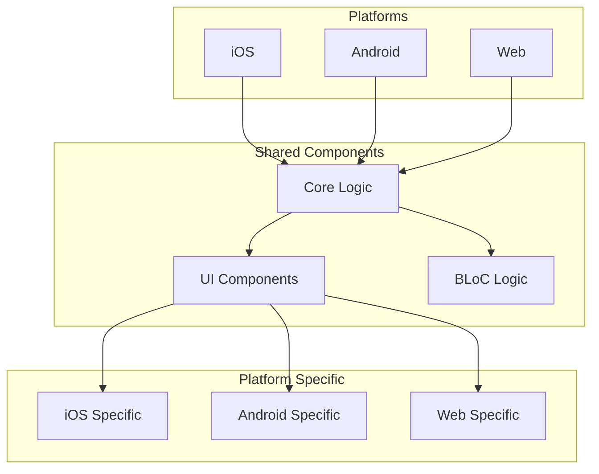

---

## 📋 Implementation Status Summary

| Feature | Priority | Status | Components |
|---------|----------|--------|------------|
| Chat Interface | P0 | ✅ Complete | ChatBloc, ChatScreen, MessageBubble |
| File Upload & Q&A | P1 | ✅ Complete | FileBloc, FileManagementScreen, FileModel |
| Custom Agents | P2 | ✅ Complete | AgentBloc, AgentManagementScreen, AgentModel |
| Conversation Management | P1 | ✅ Complete | ChatBloc events, conversation persistence |
| Local LLM Integration | P0 | 🔄 Pending | flutter_gemma integration |
| File Processing | P1 | 🔄 Pending | PDF/DOCX parsing libraries |
| Persistent Storage | P1 | 🔄 Pending | Hive/SQLite implementation |

## 🎯 Next Steps

1. **Integrate flutter_gemma** for actual LLM functionality
2. **Add file processing libraries** (pdf_text, docx) for document parsing
3. **Implement persistent storage** with Hive or SQLite
4. **Add navigation** between screens
5. **Connect BLoCs** in main app widget
6. **Add error handling** and loading states
7. **Implement export functionality** for conversations
8. **Add search functionality** for conversations and files 