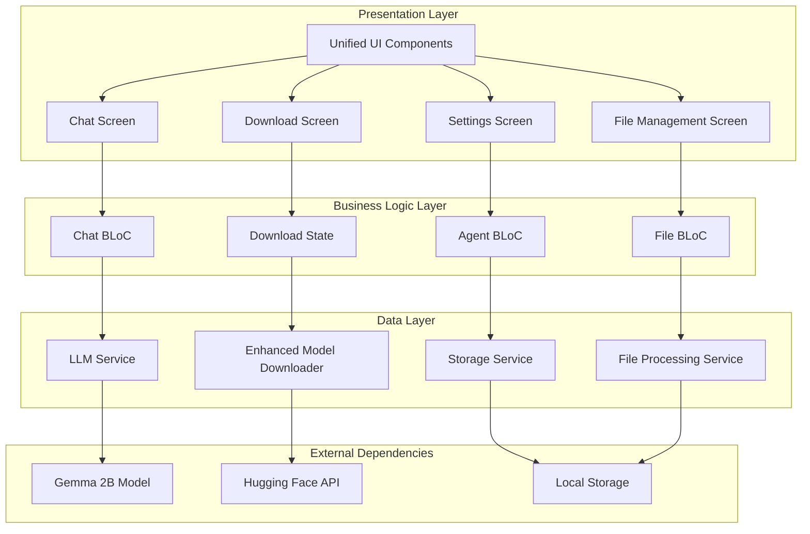
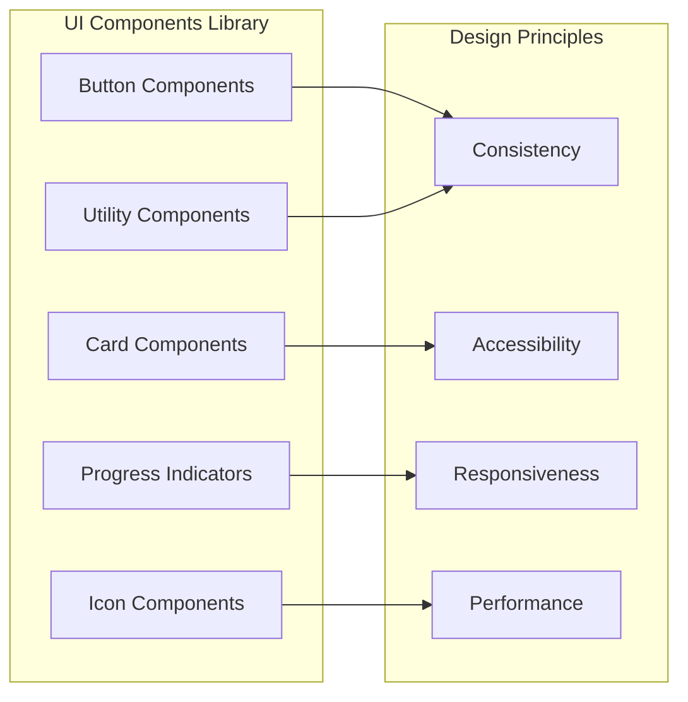
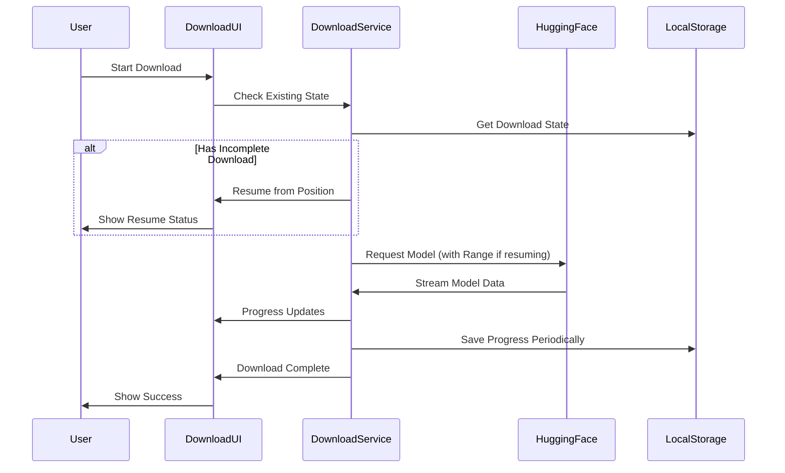
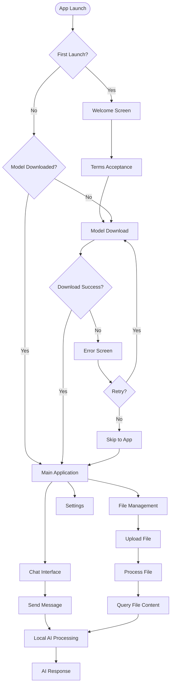
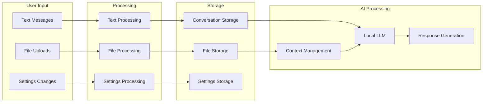
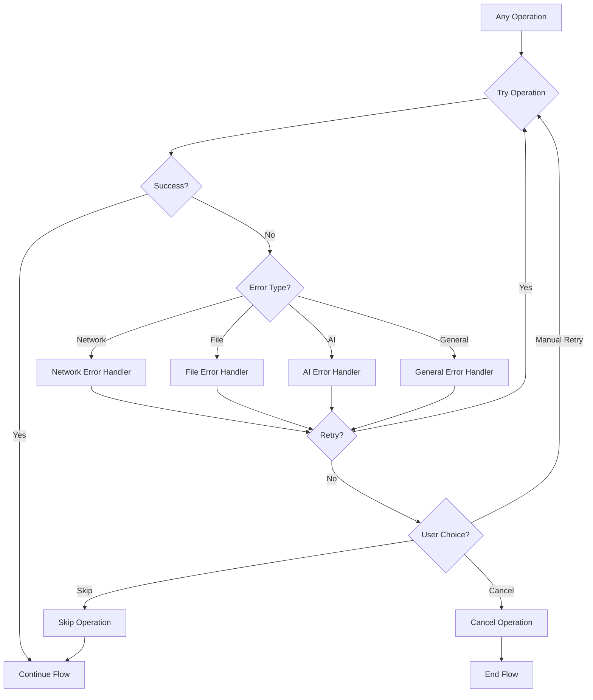
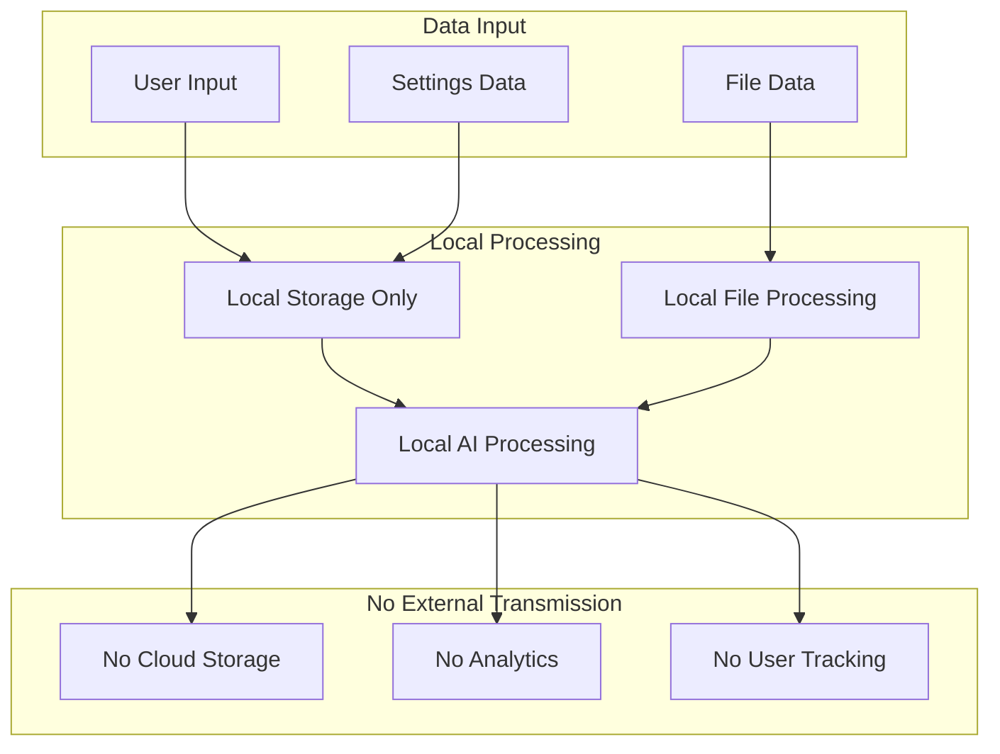
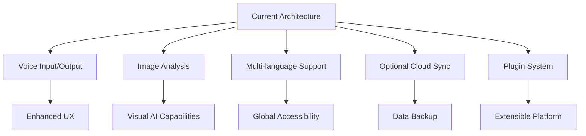

# GenLite Architecture Flow Diagram

## Overview

This document provides a comprehensive view of GenLite's architecture, data flow, and component interactions. The application follows Clean Architecture principles with a focus on privacy, performance, and user experience.

## System Architecture

## Component Details

### 1. Unified UI Design System

**Key Components:**
- `PrimaryButton`: Main action buttons with loading states
- `SecondaryButton`: Secondary actions with outline style
- `DangerButton`: Destructive actions with error styling
- `AppCard`: Consistent card styling with optional tap actions
- `AppProgressBar`: Animated progress bars with proper width calculation
- `AppIcon`: Consistent icon styling with background options
- `AppBadge`: Status indicators and labels
- `AppDivider`: Consistent dividers
- `AppSpacing`: Standardized spacing constants

### 2. Enhanced Model Downloader

**Key Features:**
- **Resume Functionality**: HTTP Range requests for partial downloads
- **State Persistence**: Download progress saved to SharedPreferences
- **Error Recovery**: Automatic retry with exponential backoff
- **Progress Tracking**: Real-time speed, time, and percentage updates
- **File Integrity**: Validation of downloaded chunks

### 3. Application Flow

### 4. State Management Flow

```mermaid
graph TD
    subgraph "Chat Feature"
        ChatEvent[Chat Events]
        ChatBLoC[Chat BLoC]
        ChatState[Chat States]
        ChatUI[Chat UI]
    end
    
    subgraph "File Management"
        FileEvent[File Events]
        FileBLoC[File BLoC]
        FileState[File States]
        FileUI[File UI]
    end
    
    subgraph "Settings"
        AgentEvent[Agent Events]
        AgentBLoC[Agent BLoC]
        AgentState[Agent States]
        SettingsUI[Settings UI]
    end
    
    ChatEvent --> ChatBLoC
    ChatBLoC --> ChatState
    ChatState --> ChatUI
    
    FileEvent --> FileBLoC
    FileBLoC --> FileState
    FileState --> FileUI
    
    AgentEvent --> AgentBLoC
    AgentBLoC --> AgentState
    AgentState --> SettingsUI
```

### 5. Data Flow Architecture

### 6. Error Handling Flow

### 7. Security and Privacy Flow

## Technical Specifications

### Performance Characteristics

| Component | Response Time | Memory Usage | Storage |
|-----------|---------------|--------------|---------|
| App Launch | < 2 seconds | ~50MB | ~4GB (model) |
| Chat Response | < 3 seconds | ~100MB | Minimal |
| File Upload | < 5 seconds | ~20MB | File size |
| Model Download | Variable | ~50MB | ~4GB |

### Scalability Considerations

1. **Horizontal Scaling**: Not applicable (local-only)
2. **Vertical Scaling**: Limited by device capabilities
3. **Model Optimization**: Quantized models for efficiency
4. **Memory Management**: Efficient resource usage
5. **Storage Optimization**: Compressed model storage

### Reliability Features

1. **Download Resume**: Automatic resume of interrupted downloads
2. **Error Recovery**: Comprehensive error handling and retry logic
3. **State Persistence**: Critical state saved across app restarts
4. **Data Validation**: Input validation and file integrity checks
5. **Graceful Degradation**: App continues working with limited features

## Future Architecture Considerations

### Planned Enhancements

### Scalability Roadmap

1. **Model Optimization**: Smaller, faster models
2. **Memory Efficiency**: Reduced memory footprint
3. **Battery Optimization**: Power-efficient processing
4. **Startup Speed**: Faster app initialization
5. **Offline Capabilities**: Complete offline functionality

---

## Conclusion

GenLite's architecture prioritizes privacy, performance, and user experience while maintaining clean, maintainable code. The unified design system, enhanced download management, and robust error handling create a professional, reliable application that users can trust with their data.

**Key Architectural Principles:**
1. **Privacy First**: All processing happens locally
2. **User Experience**: Smooth, stable, and intuitive interface
3. **Maintainability**: Clean architecture and consistent patterns
4. **Reliability**: Robust error handling and recovery mechanisms
5. **Performance**: Optimized for mobile devices

**Document Version:** 2.0  
**Last Updated:** December 2024  
**Next Review:** January 2025 